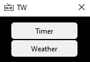
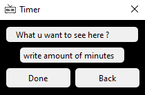
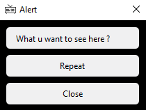
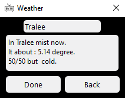
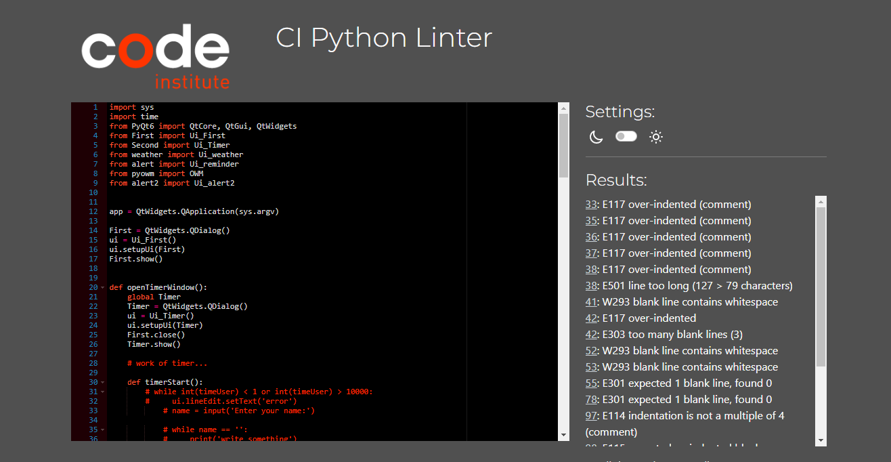
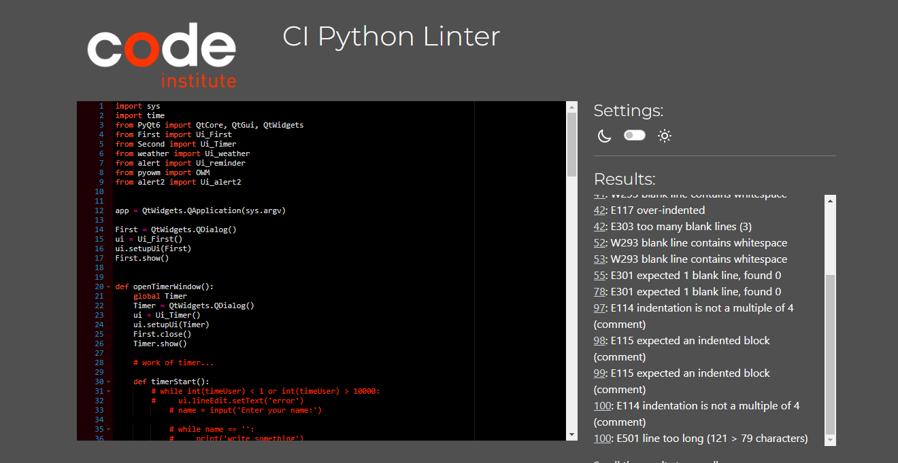

# TW 
- This is attempt of kindfull app and it working.So, we have only 2 buttons. 1-st is Timer open the window where you can choose after x minutes you will recieve a notification what this time pass.
2-nd is Wheather button, what open window where you can choose any city or country.You will recieve temperature, clouds condition and advice what you need to dress.

      

- All navigation buttons work correctly
## Technologies Used
# 
- QT designer (https://build-system.fman.io/qt-designer-download)
- Python
- Libraries
    - PYQT6 (https://pypi.org/project/PyQt6/)
    - pyowm (https://pypi.org/project/pyowm/)
    - time (built-in Python)

## Logic

- Download QTdesigner and create a design.After you recieve file.ui. You need to convert it to file.py for working.Use this command(python -m PyQt6.uic.pyuic -x file.ui -o file.py)
After you need to import main class from every file to your main(run.py).After this you can call action for every button in your main.
- Pyowm - library for recieve a weather. You need a registrate your account on webite of https://home.openweathermap.org/users/sign_up.After you recive your own key for use this pip :
owm = OWM("4383a10a783aec00988fb6992379ab92")
observation = mgr.weather_at_place(place) - this string give you cities and country and you can put this data where you want.

### Bugs
- First bug when you write a 'comment' for recieve after x minutes i cant share this data from first page to reminder window.

- Second bug validators for input data from user not working.If you will write city or country what not exist or something except numbers in timer you will broke this app.
It happen because in PYQT6 library working another rules for validators and i couldn't find it.

#### Validator Testing

